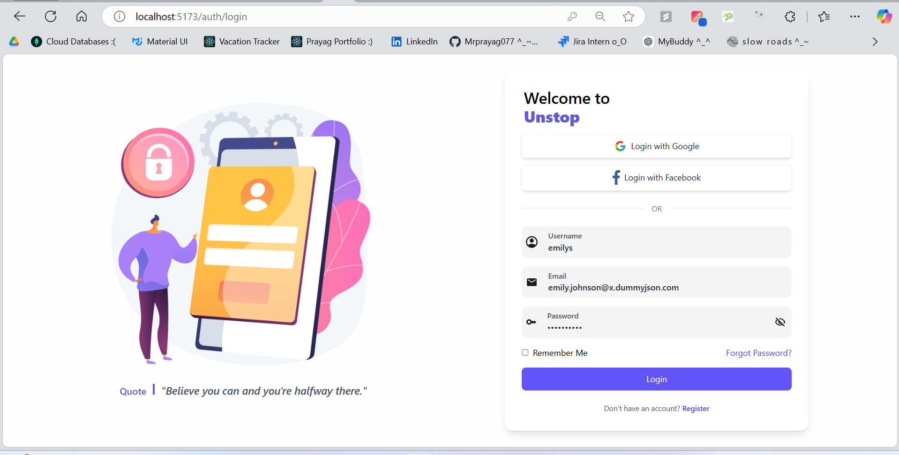
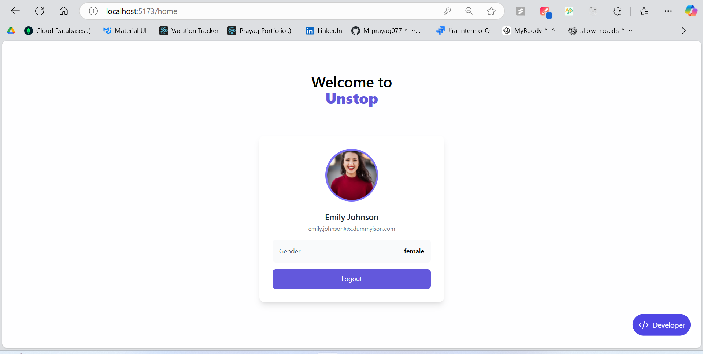
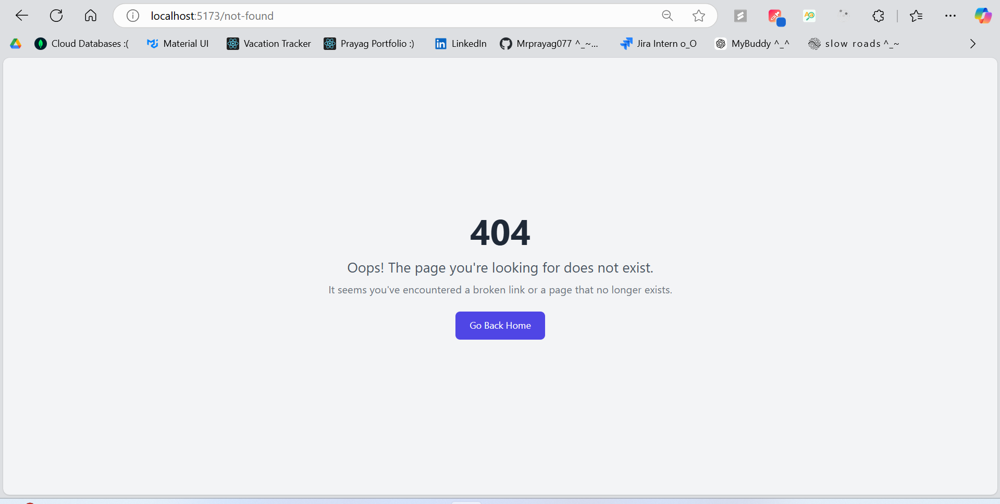
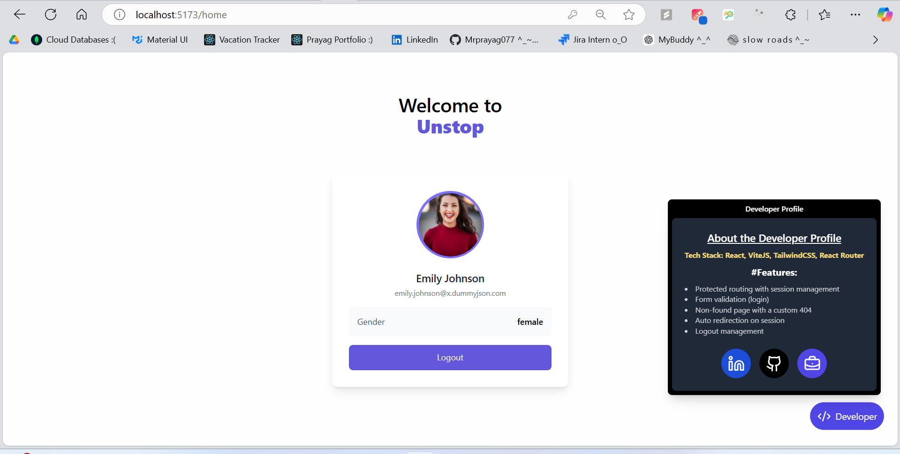

# Assignment U_N_S_T_O_P - FrontEnd Engineer

## Project Overview

**Features:**

- Protected routing with session management.
- Dynamic Quotes section in login page.
- Form validation for login forms.
- Non-found page with a custom 404 message.
- Auto-redirection if a session is already found.
- Logout management for user sessions.

This project is built using **React**, **TailwindCSS**, and **Javascript** for backend management. The goal of this app is to create a clean, responsive user interface while maintaining a smooth user experience.


### Images

Here are some screenshots of my recent work:






## Tech Stack

- **Frontend:**

  - React
  - Javascript
  - TailwindCSS
  - React Router

- **Development Tools:**
  - VS Code
  - Git and GitHub

## Architecture

The application follows a simple **single-page application** (SPA) architecture using React. The app is divided into several reusable components like `Header`, `Login`, `ProtectedRoute`, `HeaderTitle`, and `AboutMe`.

- **Routing:** React Router is used for navigation between different pages (e.g., Home, Profile, Login).
- **Session Management:** Firebase Authentication is used to manage user login and session persistence. If a user is already logged in, they will be automatically redirected to the Home page.
- **Responsive Design:** TailwindCSS is used for responsive UI. The layout adjusts based on screen size to ensure a seamless experience across devices.

## Installation & Setup

To get this project up and running on your local machine, follow the steps below:

### Prerequisites

- **Node.js** and **npm** installed on your machine.
  - You can download Node.js from [here](https://nodejs.org/).

### Steps to Install

1. Clone the repository:

   ```bash
   git clone https://github.com/your-username/developer-profile.git

   ```

2. Navigate to the project directory:

   ```bash
   cd project

   ```

3. Install dependencies:

   ```bash
   npm install

   ```

4. Start the development server:
   ```bash
   npm run dev
   ```

## My Portfolio

Welcome to my project! I'm **Prayag Bhosale**, a passionate **Frontend Developer** with a strong focus on creating dynamic, user-friendly web applications. I specialize in **React.js**, **TypeScript**, and **AWS**, and I'm always eager to take on new challenges and grow my skills. With a background in **Information Technology**, I have developed and contributed to several projects, including **vacation trackers**, **transportation platforms**, and **disaster management tools**. I thrive in fast-paced environments, having participated in multiple **Hackathons**, where I was recognized for my innovative solutions and collaborative approach.

Check out my work and connect with me through the following links:

- **Portfolio**: [Prayag's Portfolio](https://mrprayag-portfolio-2d915.web.app/)
- **LinkedIn**: [Prayag's LinkedIn](https://www.linkedin.com/in/prayagbhosale22/)
- **GitHub**: [Prayag's GitHub](https://github.com/Mrprayag077)
